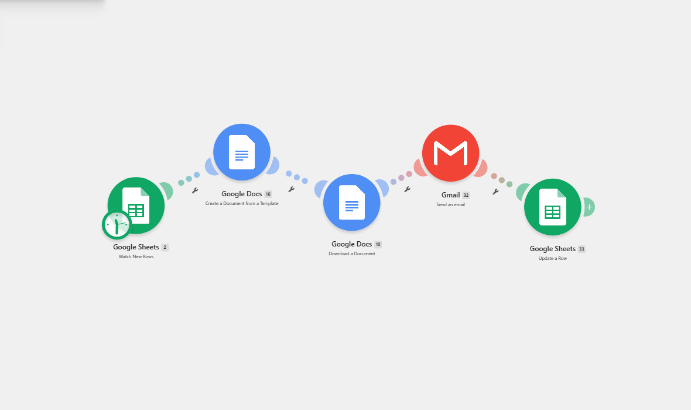
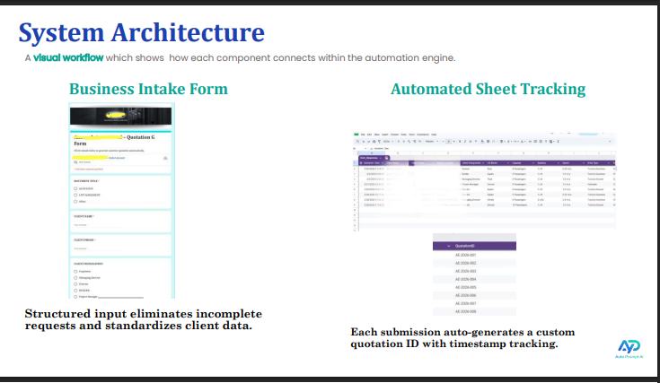
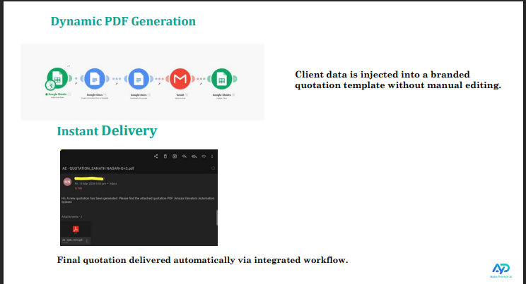

# Business Quotation Automation

An automated quotation generation workflow built for a real business use case using Make.com and Google Workspace.

## Overview

This project automates the quotation preparation process from data collection to PDF generation and email delivery.

The workflow connects Google Forms, Google Sheets, Make.com, Google Docs, PDF generation, and Gmail to reduce repetitive manual work involved in preparing business quotations.

## Business Problem

The manual quotation process required entering and transferring quotation information across multiple steps.

This included:

- Collecting quotation details
- Validating and organizing the data
- Mapping information into a quotation template
- Generating the quotation document
- Creating the final PDF
- Sending the quotation by email
- Tracking quotation information

The manual process took approximately **15–20 minutes** per quotation.

## Automated Solution

The workflow automates the process from initial quotation input to final delivery.

**Google Form → Google Sheets → Make.com → Data Validation & Mapping → Google Docs → PDF Quotation → Gmail / Email Delivery**

Once the required quotation information is submitted, the automation processes the data, maps it to the quotation template, generates the quotation document, creates the final PDF, and delivers it through email.

## Workflow Architecture

| Stage | Process |
|---|---|
| 1 | Google Form |
| ↓ | Data submission |
| 2 | Google Sheets |
| ↓ | Store quotation information |
| 3 | Make.com |
| ↓ | Workflow orchestration |
| 4 | Data Validation & Mapping |
| ↓ | Map quotation fields to template |
| 5 | Google Docs |
| ↓ | Generate quotation document |
| 6 | PDF Quotation |
| ↓ | Create final quotation PDF |
| 7 | Gmail / Email Delivery |
| | Deliver completed quotation |
### Workflow Architecture

### System Architecture

### Automated Email Delivery

## Key Automation Steps

### 1. Data Collection

Quotation information is collected through a Google Form.

### 2. Data Storage

Submitted information is captured and organized in Google Sheets.

### 3. Workflow Automation

Make.com processes the submitted quotation data and manages the automation flow.

### 4. Data Validation & Mapping

The required quotation fields are processed and mapped to the corresponding locations in the quotation template.

### 5. Document Generation

The workflow creates a quotation document using Google Docs.

### 6. PDF Generation

The generated quotation document is converted into a PDF suitable for delivery.

### 7. Email Delivery

The completed quotation is delivered through Gmail/email.

### 8. Tracking

Quotation information and identifiers can be tracked through the connected Google Sheets workflow.

## Tools Used

| Technology | Purpose |
|---|---|
| Make.com | Workflow automation and orchestration |
| Google Forms | Quotation data collection |
| Google Sheets | Data storage and tracking |
| Google Docs | Quotation document generation |
| PDF | Final quotation output |
| Gmail | Email delivery |
| Google Workspace | Connected business workflow |

## Results

The automated workflow reduced quotation processing time from approximately:

**15–20 minutes → under 10 seconds**

This demonstrates how workflow automation can reduce repetitive manual processing in a business environment.

## Lessons Learned

This project provided practical experience with:

- Workflow design
- Data mapping
- Business process automation
- Google Workspace integration
- Document generation
- PDF generation
- Email automation
- Process optimization
- Tracking and validation

## Security & Privacy

This repository is a sanitized portfolio representation of the automation.

The repository does not contain:

- Private customer information
- Confidential quotation data
- Private documents
- API keys
- Passwords
- Make.com credentials
- Webhook secrets
- Google credentials
- Private email addresses
- Private Google Sheets

## Limitations

The public repository documents the architecture and approach rather than exposing the private client implementation.

Client-specific information and the original private automation are intentionally excluded.

## Future Improvements

Potential improvements include:

- Additional validation rules
- More comprehensive error handling
- Improved quotation tracking
- Additional notification workflows
- Further process monitoring and reporting
